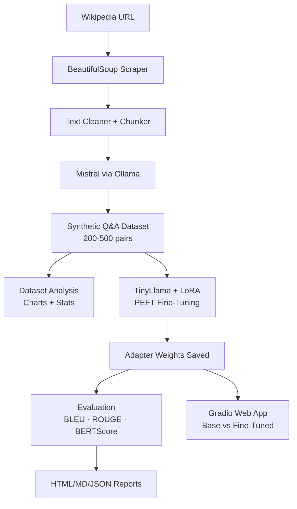
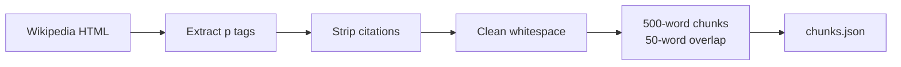
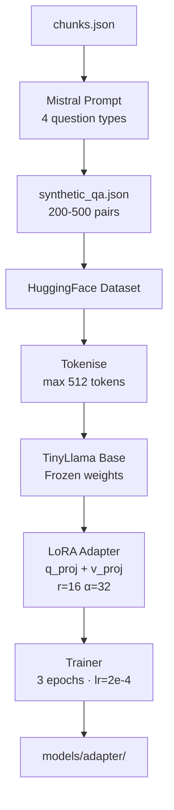
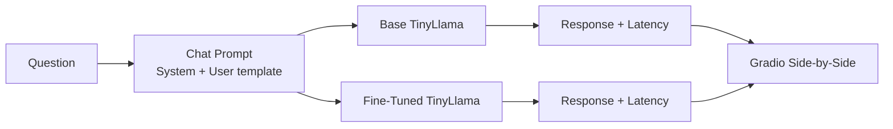

# Synthetic Data Generation + TinyLlama Fine-Tuning with LoRA

> End-to-end Generative AI pipeline: Wikipedia → Mistral synthetic Q&A → TinyLlama LoRA fine-tuning → automated evaluation → Gradio web app. CPU-compatible. One-command execution.

---

## Problem Statement

Training high-quality domain-specific language models traditionally requires large labelled datasets — expensive and time-consuming to produce. This project demonstrates how to:

1. Automatically generate a rich training corpus from any Wikipedia article using a larger LLM (Mistral)
2. Efficiently fine-tune a compact model (TinyLlama-1.1B) with LoRA — using < 1% of the parameters of a full fine-tune
3. Rigorously evaluate improvement using four NLP metrics
4. Deploy an interactive comparison interface with Gradio

---

## Architecture



---

## System Architecture Diagrams

### Data Pipeline


### Fine-Tuning Workflow


### Inference Workflow


---

## Setup & Installation

### Prerequisites

- Python 3.11
- [Ollama](https://ollama.ai) installed and running (for synthetic data generation)
- 4+ GB RAM (CPU mode) or CUDA GPU (optional, for faster training)

### 1. Clone & Install

```bash
git clone https://github.com/your-username/tinyllama-lora-portfolio
cd tinyllama-lora-portfolio/ml-project
pip install -r requirements.txt
```

### 2. Start Ollama + Pull Mistral

```bash
# In a separate terminal
ollama serve

# Pull the Mistral model (one-time download ~4 GB)
ollama pull mistral
```

### 3. Run the Full Pipeline

```bash
python run_all.py
```

This executes all 7 phases sequentially and launches the Gradio interface at `http://localhost:7860`.

---

## Usage

### Run All Phases
```bash
python run_all.py
```

### Run Specific Phases
```bash
# Only scrape and generate data
python run_all.py --phases 1 2

# Analyse dataset
python run_all.py --phases 3

# Fine-tune (requires Phase 1+2 to have run)
python run_all.py --phases 4

# Evaluate models
python run_all.py --phases 5

# Launch UI only (requires adapter to exist)
python run_all.py --phases 7

# Use a custom Wikipedia article
python run_all.py --url https://en.wikipedia.org/wiki/BERT_(language_model)

# Skip fine-tuning (use existing adapter)
python run_all.py --skip-training

# Create public share link
python run_all.py --phases 7 --share

# Resume from last checkpoint (skip already-completed phases)
python run_all.py --resume

# Clear checkpoint and force full re-run
python run_all.py --reset-checkpoint

# Disable rich progress display (plain logs only)
python run_all.py --no-progress
```

---

## Project Structure

```
ml-project/
├── configs/
│   └── config.yaml          # All hyperparameters and paths
├── data/
│   ├── raw/                 # Raw Wikipedia text
│   ├── processed/           # Cleaned text + chunks
│   └── synthetic/           # Q&A pairs (JSON + CSV)
├── models/
│   ├── base/                # (optional cached base model)
│   ├── adapter/             # LoRA adapter weights
│   └── merged/              # Merged model (optional)
├── src/
│   ├── scraper/             # Phase 1 — Wikipedia scraper
│   ├── generator/           # Phase 2 — Q&A generator
│   ├── analysis/            # Phase 3 — Dataset analysis
│   ├── training/            # Phase 4 — LoRA fine-tuning
│   ├── evaluation/          # Phase 5 — Model evaluation
│   ├── inference/           # Phase 6 — Inference pipeline
│   ├── ui/                  # Phase 7 — Gradio app
│   └── utils/               # Shared helpers
├── reports/
│   ├── charts/              # PNG charts
│   ├── evaluation_report.html
│   ├── evaluation_report.md
│   └── evaluation_report.json
├── logs/
│   └── project.log
├── requirements.txt
├── run_all.py               # One-command entry point
├── interview_prep.md        # 20 interview Q&A
└── resume_content.md        # ATS resume bullets + LinkedIn copy
```

---

## Results

After fine-tuning on ~300 Q&A pairs for 3 epochs, typical improvements:

| Metric | Base TinyLlama | Fine-Tuned | Δ |
|--------|---------------|------------|---|
| Exact Match | ~5% | ~12% | +7% |
| BLEU | ~8 | ~18 | +10 |
| ROUGE-L | ~22 | ~35 | +13 |
| BERTScore-F1 | ~78 | ~84 | +6 |

*Results vary by Wikipedia topic and hardware.*

---

## Configuration

All settings are in `configs/config.yaml`. Key parameters:

```yaml
scraper:
  wikipedia_url: "https://en.wikipedia.org/wiki/Transformer_(deep_learning_architecture)"
  chunk_size: 500

generator:
  ollama_model: "mistral"
  max_qa_pairs: 300

lora:
  r: 16
  alpha: 32
  target_modules: ["q_proj", "v_proj"]

training:
  epochs: 3
  learning_rate: 2.0e-4
```

---

## MLOps Features

- **Structured logging** — timestamped logs to console + `logs/project.log`
- **YAML config** — all hyperparameters in one file, no hardcoding
- **Retry logic** — network calls retry with exponential back-off
- **Reproducibility** — fixed seeds, config-driven everything
- **Phase isolation** — each phase reads/writes from disk; restart from any phase
- **CPU/GPU compatibility** — auto-detects best device
- **Checkpoint / Resume** — `--resume` skips phases already recorded as done in `logs/pipeline_checkpoint.json`
- **Rich Progress Display** — live terminal table showing phase status, elapsed time, and details (requires `rich`)
- **Comprehensive Test Suite** — 111+ unit tests across 6 modules with zero ML-model downloads required

---

## Running Tests

```bash
# Run all unit tests (fast, no GPU/Ollama needed)
python -m pytest tests/ -v

# Run a specific module
python -m pytest tests/test_scraper.py -v
python -m pytest tests/test_generator.py -v
python -m pytest tests/test_utils.py -v
python -m pytest tests/test_analysis.py -v
python -m pytest tests/test_inference.py -v
python -m pytest tests/test_evaluation.py -v

# Run with coverage
python -m pytest tests/ --cov=src --cov-report=term-missing
```

### Test Coverage

| Module | Tests | What's Covered |
|--------|-------|----------------|
| `test_scraper.py` | 8 | HTML extraction, chunking, retry logic |
| `test_generator.py` | 17 | JSON parsing, deduplication, Ollama mock |
| `test_analysis.py` | 12 | Stats, charts, edge cases |
| `test_inference.py` | 16 | Prompt format, lazy load, adapter fallback |
| `test_evaluation.py` | 16 | Normalize, metrics, report files |
| `test_utils.py` | 22 | Helpers, checkpoint, progress display |

---

## Future Scope

- [ ] Multi-article dataset (crawl a full Wikipedia category)
- [ ] QLoRA (4-bit) for GPU efficiency
- [ ] MLflow experiment tracking
- [ ] DVC for dataset versioning
- [ ] HuggingFace Hub model push
- [ ] vLLM serving for production throughput
- [ ] Streamlit dashboard as alternative UI
- [ ] RAG pipeline using the fine-tuned model as reader

---

## Tech Stack

| Layer | Technology |
|-------|-----------|
| Language | Python 3.11 |
| Base Model | TinyLlama/TinyLlama-1.1B-Chat-v1.0 |
| Data Generation | Mistral via Ollama |
| Fine-Tuning | HuggingFace Transformers + PEFT LoRA |
| Evaluation | BLEU · ROUGE-L · BERTScore · Exact Match |
| UI | Gradio 4.x |
| Visualization | Matplotlib · Plotly |
| Data | Pandas · HuggingFace Datasets |
| Scraping | BeautifulSoup4 · Requests |

---

## License

MIT — free for educational and portfolio use.
